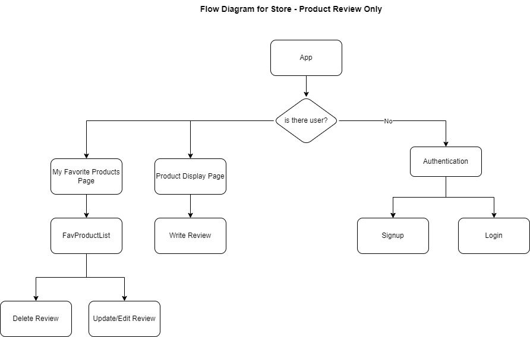
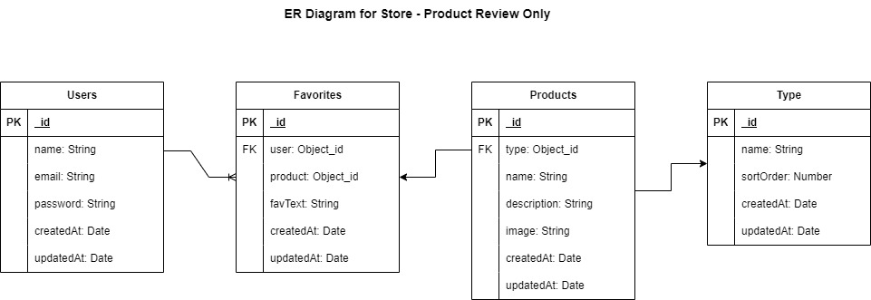
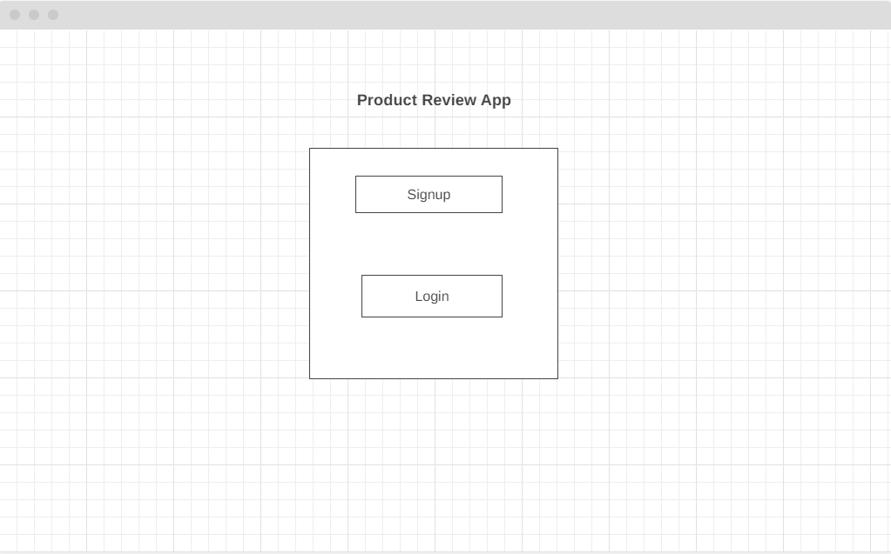
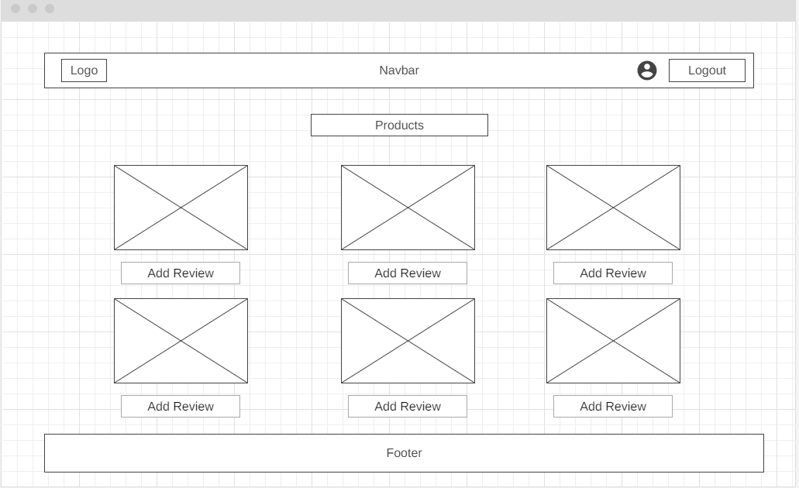
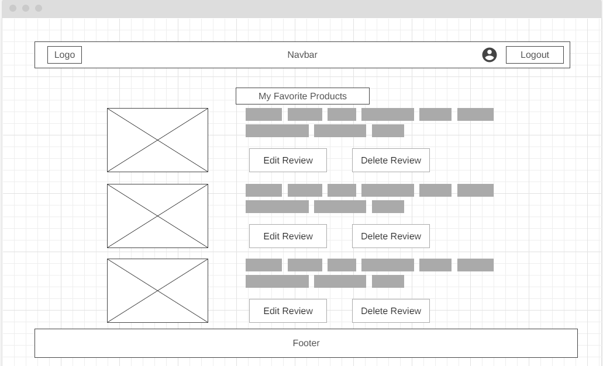

# MERN Product Review App

Welcome to the MERN Product Review App! This application allows users to browse, submit, and read reviews for various products.

## Table of Contents

- [Getting Started](#getting-started)
- [Prerequisites](#prerequisites)
- [Installation](#installation)
- [Features](#features)
- [Tech Stack](#tech-stack)
- [Project Structure](#project-structure)
- [Configuration](#configuration)
- [API Endpoints](#api-endpoints)
- [Contributing](#contributing)
- [Acknowledgments](#acknowledgments)
- [Contact](#contact)

## Getting Started

These instructions will help you set up and run the MERN Product Review App on your local machine.

### Prerequisites

- Node.js and npm installed on your machine.
- MongoDB installed locally or a MongoDB Atlas account.

### Install Dependencies

npm install
npm create vite@lates
npm run build
NPM :"bcrypt": "^5.1.1",
    "dotenv": "^16.3.1",
    "express": "^4.18.2",
    "jsonwebtoken": "^9.0.2",
    "mongoose": "^8.0.3",
    "morgan": "^1.10.0",
    "react": "^18.2.0",
    "react-dom": "^18.2.0",
    "react-router-dom": "^6.21.1",
    "serve-favicon": "^2.5.0"

### Features
Browse products and their reviews.
Submit reviews for products.
User authentication for submitting reviews.

### Tech Stack
React.js for the frontend.
Node.js and Express for the backend.
MongoDB for the database.

### Projest Structure
``
/mern-product-review-app
  ├── /client          # Frontend React app
  ├── /server          # Backend Node.js and Express server
      ├── /config      # Server configurations
      ├── /controllers # Route controllers
      ├── /models      # MongoDB models
      ├── /routes      # Express routes
      └── server.js    # Server entry point
  ├── /database        # Database configurations
  ├── /public          # Public assets
  └── README.md        # Project documentation

### Configuration 
Database configuration settings can be found in /database/config.js.
Server configuration settings can be found in /server/config/.

### API Endpoints

GET /api/products: Get all products.
GET /api/products/:productId: Get a specific product by ID.
GET /api/reviews/:productId: Get reviews for a specific product.
POST /api/reviews/:productId: Submit a review for a specific product.

More detailed API documentation....

### Flow Chart

### ER Diagram

### Wireframes

## Login Page

## Product Display Page

## User Product Review Display Page

### Acknowledgments
Thanks to my Instructor C Takara, per scholas team for inspiration and guidance.